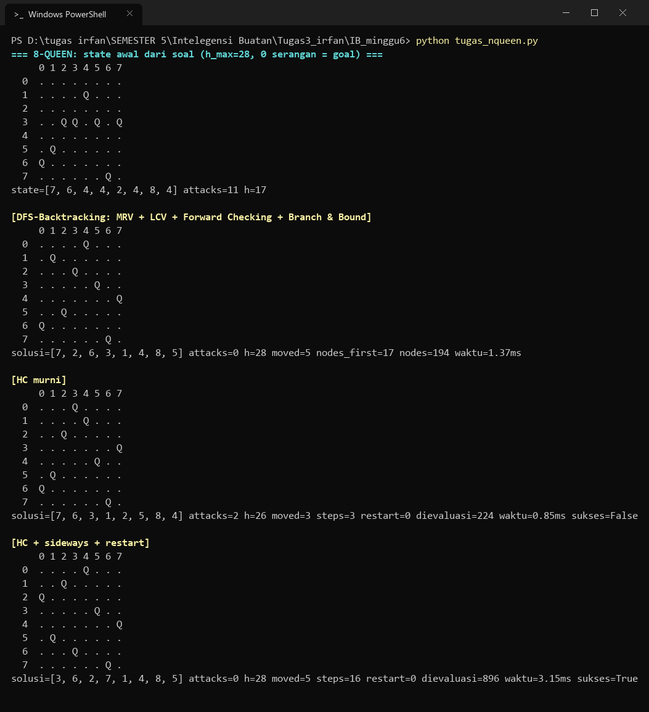
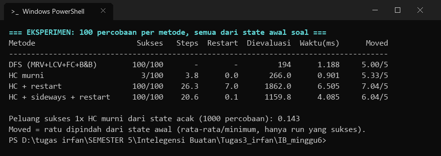

# Tugas Kelompok Berbasis Kasus 02 — Beyond Classical Search

## Kasus: 8-Queen

Puzzle 8-Queen: taruh **8 ratu** di papan 8x8 supaya tidak ada yang saling serang (baris, kolom, diagonal).

Dipilih dari 3 opsi (N-Queen / Sudoku / Kakuro) karena ruang statusnya jelas terdefinisi, constraint-nya biner dan mudah diverifikasi, serta kedua pendekatan (konstruktif dan perbaikan iteratif) dapat diterapkan langsung untuk perbandingan yang adil.

Diselesaikan dengan:
1. **DFS-Backtracking** + MRV, LCV, Forward Checking, dan Branch & Bound
2. **Local Search: Hill Climbing** + Sideways Move + Random Restart

---

## 1. Kondisi Awal & Kondisi Tujuan

### Kondisi awal (dari soal, slide 57)

Posisi ratu (baris, kolom) 0-index: `(6,0) (5,1) (3,2) (3,3) (1,4) (3,5) (7,6) (3,7)`

```
     0 1 2 3 4 5 6 7
  0  . . . . . . . .
  1  . . . . Q . . .
  2  . . . . . . . .
  3  . . Q Q . Q . Q
  4  . . . . . . . .
  5  . Q . . . . . .
  6  Q . . . . . . .
  7  . . . . . . Q .
```

Dalam program: `INITIAL_STATE = [7, 6, 4, 4, 2, 4, 8, 4]` (index = kolom 0-7, value = baris 1-8 = baris slide + 1).

State awal ini punya **11 pasang ratu saling serang**, sehingga `h = 28 - 11 = 17`:
- sebaris (baris 3): kolom 2-3, 2-5, 2-7, 3-5, 3-7, 5-7 → 6 pasang
- diagonal: kolom 0-1, 0-3, 1-3, 2-4, 2-6 → 5 pasang

### Kondisi tujuan

- **Goal**: `attacks = 0` (alias `h = 28`), yaitu 8 ratu tidak ada yang saling serang.
- 8-Queen punya 92 konfigurasi goal. Karena kondisi awal sudah ditentukan, goal **optimal** adalah goal yang membutuhkan **perpindahan ratu paling sedikit** dari kondisi awal (`moved` minimum).
- Hasil brute-force atas 92 solusi: minimum **5 ratu dipindah**, dicapai oleh 3 konfigurasi:
  `[3,6,2,7,1,4,8,5]`, `[3,6,2,7,5,1,8,4]`, `[7,2,6,3,1,4,8,5]`.

---

## 2. Formulasi Masalah

| Elemen | Isi |
|--------|-----|
| State | `list 8 angka`, index = kolom 0-7, value = baris 1-8 |
| Variable | Kolom `C0..C7` (1 ratu per kolom) |
| Domain | Baris `{1..8}` per kolom |
| Constraint | `Ci != Cj` dan `|Ci-Cj| != |i-j|` untuk semua `i != j` |
| Initial | `[7,6,4,4,2,4,8,4]` (dari soal) |
| Goal | `attacks = 0` (`h = 28`), optimal bila `moved` minimum |

**Fungsi objektif** (profit-oriented, makin besar makin baik, seperti di modul):
`h(n) = 28 - jumlah pasangan ratu yang saling serang`, dengan total pasangan `7+6+5+4+3+2+1 = 28`.

| State | attacks | h |
|-------|---------|---|
| awal (soal) | 11 | 17 |
| local optimum (contoh demo HC) | 2 | 26 |
| goal | 0 | 28 |

---

## 3. Metode

### DFS-Backtracking (konstruktif: incomplete → complete)
Program menaruh ratu kolom demi kolom pada papan kosong dengan optimasi berikut:
- **MRV (Minimum Remaining Values)**: kolom berikutnya adalah kolom kosong yang sisa domainnya paling sedikit.
- **LCV (Least Constraining Value)**: baris diurutkan dari yang paling sedikit menghapus nilai di domain kolom lain. Baris dari kondisi awal dicoba lebih dulu.
- **Forward Checking**: setelah ratu ditaruh, baris dan diagonal yang diserang dihapus dari domain kolom yang belum terisi. Jika ada domain yang kosong, cabang dipotong.
- **Branch & Bound**: pencarian dilanjutkan setelah solusi pertama ditemukan untuk mencari `moved` minimum. Sebuah cabang dipangkas jika `moved_sejauh_ini + (jumlah kolom kosong yang baris awalnya sudah hilang dari domain) >= moved_terbaik`. Batas bawah ini tidak pernah melebihi nilai sebenarnya, sehingga hasilnya tetap optimal.
- **Degree heuristic tidak dipakai**: di N-Queen setiap kolom berkonstrain dengan 7 kolom lain, jadi degree semua variabel selalu seri.

### Hill Climbing (perbaikan iteratif: complete → complete, path-irrelevant)
- **Steepest ascent**: tiap langkah membangkitkan 56 tetangga (geser 1 ratu dalam kolomnya) dan memilih `h` terbesar. Jika ada yang seri, dipilih acak.
- **Sideways move** (modul slide 31–32): jika tetangga terbaik nilainya sama dengan state sekarang (plateau), tetap bergerak, maksimal 100 kali berturut-turut.
- **Random restart** (modul slide 34): jika stuck di local maximum, mulai ulang dari state acak (maksimal 50 restart). Percobaan pertama selalu dimulai dari kondisi awal soal.

---

## 4. Cara Menjalankan

Hanya butuh Python 3 tanpa library tambahan.

```bash
python tugas_nqueen.py
```

---

## 5. Hasil Luaran Program

Program dijalankan dengan `python tugas_nqueen.py` (memakai `random.seed(42)`, jadi semua angka selain waktu selalu sama; waktu bisa sedikit berbeda di tiap mesin).

### Demo: kondisi awal, DFS-Backtracking, dan Hill Climbing



### Eksperimen: 100 percobaan per metode, semua dimulai dari kondisi awal soal



Peluang sukses 1x HC murni dari state **acak** adalah **0.143**, sama dengan nilai p ≈ 0.14 di modul (slide 34).

Keterangan kolom:
- **Dievaluasi** pada HC = 56 × jumlah pembangkitan tetangga. Pada DFS = jumlah node (penempatan ratu) yang dicoba.
- **Moved** = jumlah ratu yang dipindah dari kondisi awal. Rata-rata dan minimum dihitung hanya dari percobaan yang sukses.

---

## 6. Analisis Perbandingan

### a. Kualitas solusi
- Setiap solusi yang ditemukan bernilai `h = 28`, jadi dilihat dari fungsi objektif semuanya sama-sama goal. Perbedaannya ada pada **jaminan** dan **jarak dari kondisi awal**.
- **DFS-Backtracking bersifat complete dan optimal.** Solusi selalu ditemukan (100/100) dan Branch & Bound menjamin `moved = 5`, yaitu minimum hasil brute-force. Solusi pertama sudah ditemukan di node ke-17. Sisanya sampai 194 node dipakai untuk **membuktikan** bahwa tidak ada solusi dengan perpindahan lebih sedikit.
- **Hill Climbing tidak complete.** Dari kondisi awal soal, HC murni hanya sukses **3 dari 100** percobaan. Pada demo, HC berhenti di `h = 26` (2 pasang masih saling serang) setelah 3 langkah karena tidak ada tetangga yang lebih baik. Ini adalah **local maximum** seperti di modul slide 29. Kondisi awal soal memang sulit, karena 4 ratu menumpuk di baris 3 sehingga lereng terdekat mengarah ke puncak lokal.
- **Restart membuat HC selalu sukses, tetapi solusinya menjauh dari kondisi awal.** Rata-rata `moved` HC + restart adalah 7.04, karena restart membuang kondisi awal dan memulai dari state acak. Dengan sideways move, HC lebih sering lolos dari plateau tanpa restart, sehingga `moved` turun ke 6.04. Nilai minimum 5 kadang tercapai, tetapi tidak dijamin.

### b. Kecepatan pencarian
- Untuk 8-Queen dengan kondisi awal ini, **DFS lebih cepat dan lebih hemat**: 194 node / ±1.2 ms. Sebagai pembanding, HC + sideways + restart butuh ±1160 state / ±4.1 ms, dan HC + restart butuh ±1862 state / ±6.5 ms.
- DFS cepat karena Forward Checking + MRV langsung memotong cabang yang pasti gagal, dan ukuran papannya kecil.
- Satu langkah HC murah, tetapi tiap langkah mengevaluasi 56 tetangga dan setiap evaluasi menghitung ulang 28 pasang ratu. Biaya ini terkumpul di setiap restart.
- Kompleksitas waktu DFS kasus terburuk tetap eksponensial `O(b^m)`. Untuk N yang sangat besar, local search jauh lebih unggul: modul slide 34 menyebut 3 juta queens bisa diselesaikan < 1 menit (Luby et al., 1993), sedangkan DFS tidak praktis untuk ukuran itu.

### c. Memori
- **DFS**: `O(bm)`. Program menyimpan jalur rekursi sedalam 8 dan salinan domain di tiap level.
- **Hill Climbing**: `O(1)`. Program hanya menyimpan state sekarang, state terbaik, dan tetangga di langkah itu, tanpa riwayat jalur (path-irrelevant).

### d. Pengaruh restart dan sideways move
- **Restart** menaikkan tingkat sukses dari 3% menjadi 100%. Rata-rata dibutuhkan **7.0 restart**, sesuai rumus di modul: perkiraan restart = `1/p ≈ 1/0.14 ≈ 7`.
- **Sideways move** membuat HC bisa melewati plateau/shoulder. Rata-rata restart turun dari 7.0 ke **0.1**, dan jumlah state yang dievaluasi turun ±38% (1862 → 1160). Kebanyakan percobaan langsung sukses dari kondisi awal.

---

## 7. Kesimpulan

1. **DFS-Backtracking (MRV + LCV + FC + B&B)** cocok untuk 8-Queen dengan kondisi awal tertentu. Hasilnya complete, optimal (pasti 5 perpindahan), deterministik, dan pada ukuran ini juga paling cepat.
2. **Hill Climbing murni** cepat per langkah, tetapi mudah terjebak local maximum. Dari kondisi awal soal, ia hanya sukses 3%.
3. **Random restart** dan **sideways move** membuat HC praktis selalu menemukan goal. Meski begitu, HC tetap tidak menjamin solusi terdekat dari kondisi awal dan tetap bergantung pada keacakan.
4. Untuk N kecil dengan kebutuhan solusi optimal, pilih DFS-Backtracking. Untuk N sangat besar ketika cukup "solusi valid apa saja", local search lebih unggul secara waktu dan memori.

---

Mata kuliah: **Inteligensi Buatan — 2026**
